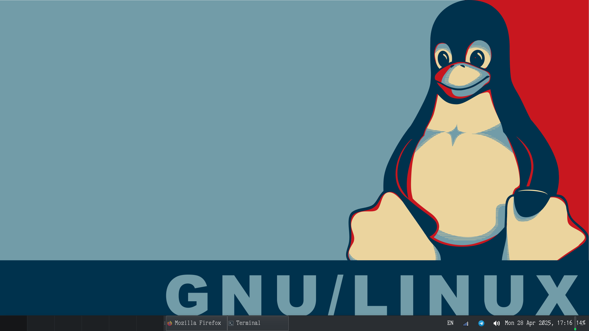
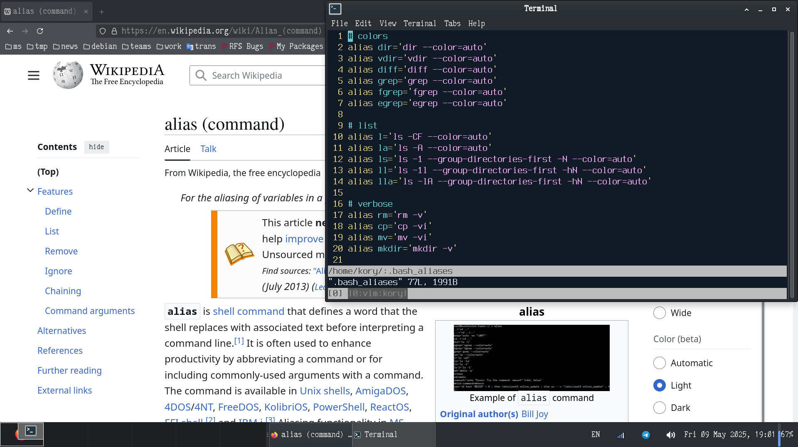
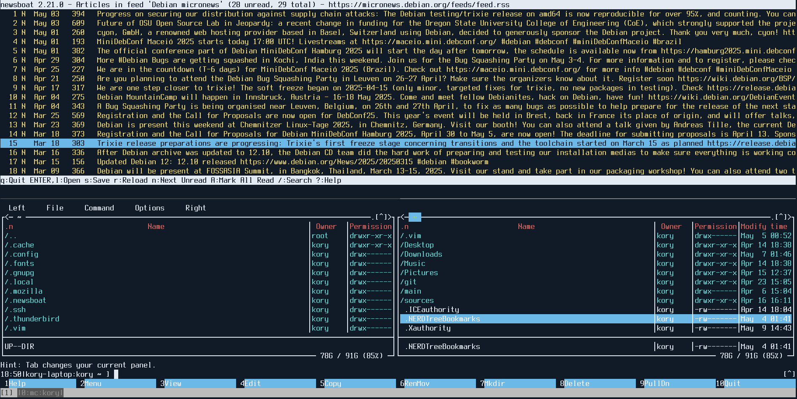

<div align="center">

</div>

## dotfiles-debian
This is my Debian dotfiles (backup). Configuration files, useful scripts and
aliases for my work, backgrounds, notes, hotkeys, various development tools,
color schemes, and launchers for some retro/classic games, etc. I’m using the
default GTK themes/icons from Debian, nothing special (see
[pkgs.list](https://github.com/krekhovx/dotfiles-debian/blob/master/pkgs.list)).

Maintained by a [Debian Maintainer](https://nm.debian.org/person/krekhov/) and
contributor to the Debian project.

I'm lazy, so there's a script
[init](https://github.com/krekhovx/dotfiles-debian/blob/master/init) which
initialize/configure my work environment automatically. I am using the latest
stable version of Debian with Xfce on my laptop.

The repository is updated frequently.

Xfce Desktop (last screenshot):


System overview:


Another one (last screenshot):


Another one (last screenshot):


Terminal Emulator with Tmux (last screenshot):


Another one (last screenshot):


- <strong>Xfce Icon Theme:</strong> ```Tango```
- <strong>Xfce GTK Theme:</strong> ```Breeze-Dark```
- <strong>Environment Font:</strong> ```PxPlus Cordata PPC-400```

## Description of the environment
- <strong>OS:</strong> ```Debian 13 (Trixie)```
- <strong>DE:</strong> ```Xfce4```
- <strong>WM:</strong> ```Xfwm4 (X11)```
- <strong>DM:</strong> ```LightDM```
- <strong>Shell:</strong> ```Bash```
- <strong>Browser:</strong> ```Firefox```
- <strong>File Manager:</strong> ```Thunar```
- <strong>Text Editor:</strong> ```Vim```, ```Mousepad```
- <strong>Terminal File Navigation:</strong> ```Midnight Commander```, ```Vifm```
- <strong>Terminal Emulator:</strong> ```xfce4-terminal```
- <strong>Terminal Multiplexer:</strong> ```Tmux```
- <strong>Compiler:</strong> ```GCC```
- <strong>Debuger:</strong> ```GDB Dashboard```
- <strong>Version Control System:</strong> ```Git```
- <strong>Text-mode interface for Git:</strong> ```Tig```
- <strong>RSS Feed Reader:</strong> ```Newsboat```
- <strong>Mail Client:</strong> ```NeoMutt```
- <strong>Desktop-base theme:</strong> ```korux-theme```
- <strong>All Environment Packages:</strong> [pkgs.list](https://github.com/krekhovx/dotfiles-debian/blob/master/pkgs.list)
- <strong>Games:</strong> ```Diablo 1```, ```Diablo 2```, ```Heroes 3```, ```Quake 1```, ```Quake 2```, ```Quake 3```

## Installation
- Install the latest stable Debian with Xfce.
- Clone repository:
```
$ git clone https://github.com/krekhovx/dotfiles-debian.git
$ cd dotfiles-debian
```
- Install the environment using a script:

Usage information:
```
$ ./init --help
```

> [!NOTE]
>
> Be careful when running this script on your main machine, it does not create
> backup dotfiles and may ~~erase~~ your current working environment.
> It's better to read the script before using it. It's simple.

Clean home, update ```/etc/apt/sources.list```, install packages:
```
$ ./init --clean-home --sources-list --install-packages
```

Configure Bash and $HOME environment:
```
$ ./init --bash --bash-completion --local-bin --local-share
```

Configure Xfce environment, LightDM and colors:
```
$ ./init --xfce --xfce-terminal --lightdm --dircolors --unclutter
```

Text editors, terminal multiplexer, debugger, file navigation:
```
$ ./init --vim --vifm --tmux --mc --mousepad --gdb
```

Telegram Desktop autostart, Firefox, Docker:
```
$ ./init --telegram-desktop --firefox --docker
```

Game scripts installation (diablo1, diablo2, heroes3, quake1, quake2, quake3):
```
$ ./init --games
```

Configure SSH server, enable QA Debian service, system default configs:
```
$ ./init --ssh-server --qa-debian-service --system-defaults
```

Free the system from unnecessary packages, set korux-theme for desktop-base:
```
$ ./init --purge-packages --set-korux-theme
```

RSS feed reader, mail reader:
```
$ ./init --newsboat --neomutt
```

The script has other options, but I think you won't need it.

## Local scripts
Location: [.local/bin/](https://github.com/krekhovx/dotfiles-debian/blob/master/.local/bin)

Few examples:<br/>

[multi-git.sh](https://github.com/krekhovx/dotfiles-debian/blob/master/.local/bin/multi-git.sh) -
execute Git commands like ```pull```, ```status``` across multiple Git projects for easy management.<br/>

[crypt.sh](https://github.com/krekhovx/dotfiles-debian/blob/master/.local/bin/crypt.sh) -
encrypt/decrypt regular file with sensitive information (using a password).<br/>

[deb-clean.sh](https://github.com/krekhovx/dotfiles-debian/blob/master/.local/bin/deb-clean.sh) -
remove ```rc``` (removed but not purged) packages plus debs autoremove and autoclean.<br/>

[apt-recent-installs.sh](https://github.com/krekhovx/dotfiles-debian/blob/master/.local/bin/apt-recent-installs.sh) -
parses the ```/var/log/apt/history.log``` file to extract installation dates and package lists.<br/>

[get-source-uris.sh](https://github.com/krekhovx/dotfiles-debian/blob/master/.local/bin/get-source-uris.sh) -
get source package URIs for a given command or path.<br/>

[qemu-launcher.sh](https://github.com/krekhovx/dotfiles-debian/blob/master/.local/bin/qemu-launcher.sh) -
launch QEMU with the provided disk or ISO image option.<br/>

[treechmod.sh](https://github.com/krekhovx/dotfiles-debian/blob/master/.local/bin/treechmod.sh) -
recursively set file and directory permissions in directory using the given umask.<br/>

[gpg-text-signer.sh](https://github.com/krekhovx/dotfiles-debian/blob/master/.local/bin/gpg-text-signer.sh) -
create a text message and sign it with GPG (clearsign or detach-sign).<br/>

etc.

## My favorite fonts
I use these fonts from time to time in my environment.

### Good readability
- Terminus
- Fira Code
- Hack Regular
- Agave Regular

### Nostalgia
- Unifont
- Glass TTY VT220
- PXPlus Cordata PPC-21
- PXPlus Cordata PPC-400

### Useful Links

[Nerd Fonts](https://www.nerdfonts.com/)

[The Oldschool PC Font Resource](https://int10h.org/oldschool-pc-fonts/)
