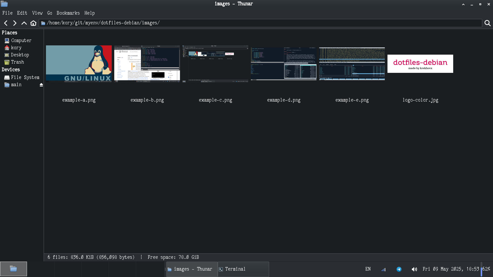
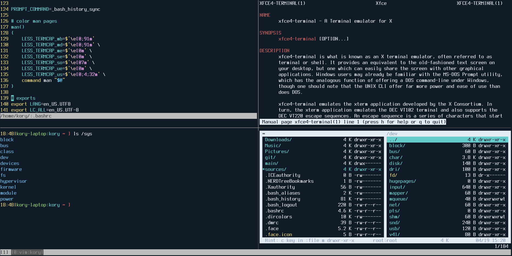

<div align="center">

</div>

## dotfiles-debian
This is my Debian dotfiles (backup). Configuration files, useful scripts and
aliases for my work, backgrounds, notes, hotkeys, various development tools,
color schemes, etc. I’m using the default GTK themes/icons from Debian - nothing
special (see [pkgs.list](https://github.com/krekhovx/dotfiles-debian/blob/master/pkgs.list)).

I'm lazy, so there's a script
[init](https://github.com/krekhovx/dotfiles-debian/blob/master/init) which
initialize/configure my work environment automatically. I am using the latest
stable version of Debian with Xfce.

The repository is updated frequently.

Xfce Desktop (last screenshot):




Terminal Emulator with Tmux (last screenshot):


Another one (last screenshot):


- <strong>Xfce Icon Theme:</strong> ```Tango```
- <strong>Xfce GTK Theme:</strong> ```Breeze-Dark```

- <strong>Xfce Terminal Font:</strong> ```Terminus```
- <strong>Xfce Environment Font:</strong> ```PxPlus Cordata PPC-400```

## Description of the environment
- <strong>OS:</strong> ```Debian```
- <strong>DE:</strong> ```Xfce```
- <strong>DM:</strong> ```LightDM```
- <strong>WM:</strong> ```Xfwm4```
- <strong>Shell:</strong> ```Bash```
- <strong>Browser:</strong> ```Firefox```
- <strong>File Manager:</strong> ```Thunar```
- <strong>Text Editor:</strong> ```Vim```, ```Mousepad```
- <strong>Terminal File Navigation:</strong> ```Midnight Commander```, ```Vifm```
- <strong>Terminal Emulator:</strong> ```xfce4-terminal```
- <strong>Terminal Multiplexer:</strong> ```Tmux```
- <strong>Compiler:</strong> ```GCC```
- <strong>Debuger:</strong> ```GDB Dashboard```
- <strong>Version control system:</strong> ```Git```
- <strong>Text-mode interface for Git:</strong> ```Tig```
- <strong>RSS Feed Reader:</strong> ```Newsboat```
- <strong>Environment Dependencies:</strong> [./init --install-packages](https://github.com/krekhovx/dotfiles-debian/blob/master/init)

## Installation
- Install Debian with Xfce.
- Clone repository:
```
$ git clone https://github.com/krekhovx/dotfiles-debian.git
$ cd dotfiles-debian
```
- Install the environment using a script:

Usage information:
```
$ ./init --help
```
**Attention**. Be careful when running this script on your main machine, it does
not create backup dotfiles and may ~~erase~~ your current working environment.

Clean home, update ```/etc/apt/sources.list```, install dependencies packages:
```
$ ./init --clean-home --sources.list --install-packages
```

Configure $HOME environment:
```
$ ./init --bash --bash-completion --local-bin --local-share
```

Configure Xfce environment and colors:
```
$ ./init --xfce --xfce-terminal --dircolors --unclutter
```

Text editors, terminal multiplexer, debuger, file navigation:
```
$ ./init --vim --vifm --tmux --mc --mousepad --gdb
```

RSS feed reader:
```
$ ./init --newsboat
```

The script has other options, but I think you won't need it.

## Scripts
Location: [.local/bin/](https://github.com/krekhovx/dotfiles-debian/blob/master/.local/bin)

Few examples:<br/>

[multi-git.sh](https://github.com/krekhovx/dotfiles-debian/blob/master/.local/bin/multi-git.sh) -
manages all specified Git projects (simple Git operations).<br/>

[crypt.sh](https://github.com/krekhovx/dotfiles-debian/blob/master/.local/bin/crypt.sh) -
encrypt/decrypt regular file with sensitive information (using a password).<br/>

[deb-clean.sh](https://github.com/krekhovx/dotfiles-debian/blob/master/.local/bin/deb-clean.sh) -
remove 'rc' (removed but not purged) packages plus debs autoremove and autoclean.<br/>

[apt-recent-installs.sh](https://github.com/krekhovx/dotfiles-debian/blob/master/.local/bin/apt-recent-installs.sh) -
parses ```/var/log/apt/history.log``` to extract installation dates and package lists.<br/>

[source-uris.sh](https://github.com/krekhovx/dotfiles-debian/blob/master/.local/bin/source-uris.sh) -
get source uris.<br/>

## My favorite fonts
I use these fonts from time to time in my environment.

```
# Good readability
> terminus
> fira code
> hack regular

# Nostalgia
> unifont
> px ibm ega8
> glass tty vt220
> pxplus cordata ppc-21
> pxplus cordata ppc-400
> pxplus toshibasat 8x14
```
